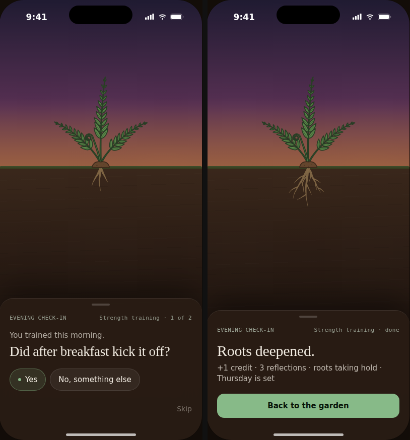

# Evening check-in — design

*How the evening check-in looks and behaves as a sheet over the garden. Read this before touching
`lib/features/reflection/pages/` or `widgets/`.*

**Governs:** the check-in's presentation: the sheet, its steps, copy, chip states, the done state
and the roots payoff behind it.
**Does not govern:** *whether* to ask, *which* habit and *which* framing. Those stay with
[reflection-logic.md](reflection-logic.md) §2–§3 and the existing `CheckInAssembler` /
`framing_selection.dart`. Chip *content* stays with
[starter-chip-library.md](starter-chip-library.md) §5 and `chip_surfacing.dart`.
**Built on:** [garden-design.md](garden-design.md). The sheet sits on the garden scene, and uses
the same tokens, fonts and world.
**Inputs it reconciles:**

- the design agent's prototype, kept in
  [design/check-in-handoff/](design/check-in-handoff/) (`README.md`, and an HTML prototype with a
  **framing** switch; open `Check-in Sheet.dc.html` through a local web server, not `file://`);
- the check-in that is already built: `CheckInPage`, `CheckInController`, `CueAnswers`,
  `FrictionAnswers`, `checkInQuestion()` and the evening notification's `composeEveningCheckIn()`.

**Where the prototype, the built check-in and the specs disagree, this document decides.**
Section 9 lists each disagreement and its resolution. Anything not mentioned here follows the
prototype README.

*Reference mock-up: the camera move (§3) with the real fern art. Left: step 1 of a Validation
check-in. Right: done, with the roots grown from level 1 to level 2 behind the sheet. The sheet
text in the mock-up is the prototype's; the copy in §5 and §7 replaces it (no credit numbers).*

---

## 1. What changes

The check-in stops being a **full-screen page** and becomes a **bottom sheet over the live
garden**. The reason is the payoff: reflection is the only thing that deepens roots, so the user
should watch the roots of the habit they just reflected on grow.

| Built today | Becomes |
|---|---|
| `CheckInPage`, a `Scaffold` with an app bar | A modal sheet over the garden. The `/check-in` route still exists, so the notification deep link keeps working, but it now opens the garden with the sheet up (§8). |
| One step: answer, then "Noted / That goes into the roots" | Two steps (**look back → commit to tomorrow**), then **done** (§4). |
| Validation shows the full cue chip list | Validation asks **Yes / No, something else** first, as reflection-logic §3 specifies (§5). |
| Material `ActionChip`s | Pill chips with default / pinned / selected states (§6). |
| Preamble lines ("Testing the cue you designed…", "No judgement…") | Dropped. A neutral **fact line** takes their place (§5). |
| "Not now" in the app bar | A **Skip** link in the sheet footer, plus swipe-down (§4.4). Still recorded as `InputMode.skipped`. |
| Nothing-to-ask / failed / loading states | Kept, shown inside the sheet (§4.5). |

What does **not** change: priority scoring, framing selection, chip surfacing, the
`Reflection` record, the credit table's home in `constants.dart`, and local-first writes.

---

## 2. Principles

1. **Two taps on the happy path.** One chip, then one commitment, then done (reflection-logic §0.3).
2. **Words for the user, weights for the engine.** Credit is an internal weighting. The sheet
   never shows credit values or a fractional reflection count (§7).
3. **At most one insight, and only above its evidence threshold** (reflection-logic §6). The
   sheet has a slot for an insight; it never makes one up.
4. **One voice.** Every sentence the sheet asks comes from the same pure functions the evening
   notification uses, so the notification and the sheet can never ask the same thing in two
   different ways.
5. **The roots are the reward.** The camera makes room for them (§3), and they grow when done
   appears (§7.2).

---

## 3. The garden behind the sheet

The scene is the garden home (garden-design §3) with a **camera move** while the sheet is open:

| | Garden home | Sheet open |
|---|---|---|
| Ground line `G` | 53% of screen height | **38%** |
| Camera scale | 1.0 (world scale 0.15) | **2.2** around the reflected plant (0.33 effective) |
| Horizontal | scroll position | reflected plant **centred** |
| Scroll | enabled | disabled |

- The camera moves the scrolling scene layers (garden-design §3, layers 4–10) as one transform.
  It is not a per-plant scale, so "one world, one scale" still holds.
- Sky, sun and haze don't move. A low dusk sun ending up behind the soil is fine.
- At 2.2×, full roots reach about 170pt below `G`, so the sheet's top edge must stay at least
  16pt below `G + 172`. If the sheet's content is taller than that allows, the sheet scrolls
  internally rather than covering the roots.
- The move runs with the sheet's entry (520 ms, `cubic-bezier(.2,.8,.2,1)`), and reverses on
  dismiss. Neighbouring plants may stay in view at the edges; they are not hidden.
- **Scrim:** one uniform layer of `oklch(0.10 0.02 50)` at **25%**, fading to **10%** when done
  appears. The prototype's 35%→55% gradient dims the roots too much for the payoff to read.
- **Root glow** (done, and only when the answer earned credit): the prototype's radial glow,
  drawn by Flutter **behind** the `FernRoots` artboard, 140pt × (root depth + 20pt), fading
  0→1→0 over 1800 ms.
- Everything else about the plant (droop, lean, colour) is the Rive art's, driven by the same
  shared view model instance the garden uses. The sheet never draws roots or leans the plant.

---

## 4. Structure

### 4.1 The sheet

As in the handoff README ("Sheet"): pinned to the bottom, 28pt top radius, padding
10 / 20 / 44, card colour at 96% with 20pt blur, 1pt top border at white 10%, entry 520 ms. Grabber,
then a meta row in mono: `EVENING CHECK-IN` on the left, `{habit name} · {step}` on the right.

`{step}` is `1 of 2`, `2 of 2` or `done`. When the commit step is skipped (§4.3), it is
`1 of 1`, then `done`.

### 4.2 Step 1: look back

Fact line, question, chips, footer. Copy per framing in §5, chip states in §6.

**The reflection is written as soon as it is answered** (on chip tap, typed save, Can't
remember or Skip), through the existing `CheckInController` methods. It does not wait for the
done step. A user who swipes the sheet away after answering keeps their answer.

After a chip tap, the selected state holds for **420 ms**, then advances to step 2. With reduced
motion there is no auto-advance: the selected chip stays, and a **Next** button appears.

**Typing sub-step:** as the README describes (single-line input, Back / Save, autofocus, the
keyboard pushes the sheet up). It wraps the existing `answerWithTypedCue` and
`answerWithTypedFriction`.

### 4.3 Step 2: commit to tomorrow

This is the look-forward half of reflection-logic §1. The answer is written to the **nudge
ledger** as the existing `NudgeResponseAction` for the next expected occasion. It is not a field
on `Reflection`.

| Chip | Records | Then |
|---|---|---|
| **Yes** (pinned) | `confirmed` | done |
| **Different day** | `declined` | done, with the sub line `We'll check in before the next one.` |

**Skip step 2 entirely** when there is nothing to commit to:

- the next occasion already has a response, for example from the notification's own Yes
  action;
- the habit is paused or graduated;
- the engine has no next expected occasion.

> **Later feature, not v1: choosing the day.** The prototype's `Different day` opens a
> `Which day?` picker with the next four scheduled days. It needs a one-off reschedule of the
> next occasion in `lib/features/notifications/` and a ledger field for the chosen day. v1
> records `declined` only. This is tracked in `docs/status.md` as a follow-up.

### 4.4 Leaving early

- **Skip link** (step 1): records `InputMode.skipped` and closes the sheet. There is no step 2
  and no done state; closing is the acknowledgement.
- **Swipe down or tap the scrim** before answering: same as Skip.
- **Swipe down after answering:** the reflection is already saved. Step 2 is simply not
  answered, and nothing extra is recorded.

### 4.5 Other states inside the sheet

The sheet opens with the offer the garden already assembled, and re-verifies it in the background
(the existing `load(offered:)`). So there is no loading state on the happy path.

- **Nothing to ask** (the offer went stale): the existing `Nothing to ask today` headline and body,
  and **Back to the garden**.
- **Failed:** the existing message and **Try again**.
- **Opened from the notification before the garden has loaded:** the garden's loading scene
  behind, and a small progress indicator in the sheet until the offer resolves.

---

## 5. Copy

All question and fact strings live in `check_in_question.dart` as pure functions, shared with
`composeEveningCheckIn()`. `{habit}` is `habit.name`; `{habit·lc}` is the name lowercased;
`{cue}` is `habit.designedCue`; `{when}` is `this morning / this afternoon / this evening` for
today (from `daypart.dart`), or `yesterday` / `on {Weekday}` for earlier.

### Step 1

| Framing | Fact | Question | Chips | Footer |
|---|---|---|---|---|
| Validation | `{habit} — done {when}.` | `Did {cue} kick it off?` | **Yes** (pinned) · No, something else | Can't remember · Skip |
| ↳ after "No, something else" | same | `What got you going, then?` | cue chips *without* the designed cue | Something else · Can't remember · Skip |
| Confirmation | `{habit} — done {when}.` | `Same as usual — {cue}?` | **Yes** (pinned) · Actually, no | Skip |
| ↳ after "Actually, no" | same | `What was it this time?` | cue chips without the designed cue | Something else · Can't remember · Skip |
| Discovery | `{habit} — done {when}.` | `What got you going?` | cue chips, designed cue pinned first | Something else · Can't remember · Skip |
| Autonomy | `{habit} — done {when}, without us asking.` | `What reminded you?` | as Discovery | Something else · Can't remember · Skip |
| Diagnosis | `No {habit·lc} {when}.` | `What got in the way?` | friction chips (surfaced) | Something else · Skip |

- **No designed cue** (tracking journey): Validation and Confirmation fall back to the existing
  `What got you going?` / `Same as usual?` and show the cue chip list directly.
- **Can't remember on reflection #1** follows starter-chip-library §9, which is still open. It
  is shown by default, behind a flag (`allowCantRememberOnFirstReflection`, default
  true), so it can be tested either way. It is never shown in Diagnosis.
- **Typing prompts:** `What got you going?` / `What got in the way?`; placeholders
  `e.g. the dog woke me up` / `e.g. dentist ran over`.
- The Validation **Yes** answers with the designed cue as a chip (`matchedDesignedCue: true`).
  **No, something else** is not an answer by itself; only the pick after it is.

### Step 2

| | Fact | Question |
|---|---|---|
| Next occasion is tomorrow | `Tomorrow, then.` | `{cue}?` (capitalised) |
| Later | `{Weekday} next, then.` | `{cue}?` |
| Diagnosis | as above | `{cue} — still the plan?` |
| No designed cue | as above | `{habit}?` |

These must match what `composeEveningCheckIn()` says. If they differ, change both together.

---

## 6. Chips

States as in the handoff README: default (white 6%, border white 12%), **pinned** (accent 14%,
border accent 45%, 6pt accent dot), **selected** (accent fill, onAccent text), press scale 0.96
over 120 ms. Pill shape, min-height 44, wrap with 8pt gaps.

- **Pinned** means *suggested*: the designed cue, and the Yes chips. Its semantic label
  announces `suggested`.
- Chips are toggle buttons for accessibility; only one can be selected.
- The chip **set** comes from `chip_surfacing.dart` and `friction_surfacing.dart` unchanged. The
  prototype's chip lists are examples (starter-chip-library §7.1, example A), not content.
- The **footer** (14pt, ink 60%) holds `Something else`, `Can't remember` and a right-aligned
  `Skip` (ink 40%) per the table in §5. They are links, not chips, which keeps them visually
  secondary.

---

## 7. Done

### 7.1 Copy: words only

| Answer | Title | Sub line |
|---|---|---|
| Any substantive answer | `Roots deepened.` | `{rootDepthLabel(R)} · {day} is set` |
| Diagnosis answer | `Thanks — that helps.` | same |
| Can't remember | `Noted.` | `An honest blank still counts. · {day} is set` |
| Step 2 = Different day | (as above) | `{rootDepthLabel(R)} · We'll check in before the next one.` |
| Step 2 skipped (§4.3) | (as above) | `{rootDepthLabel(R)}` |

- `rootDepthLabel` is the existing function in `plant_descriptions.dart`, capitalised. Its
  bands (0.30 / 0.50 / 0.75) are the ones used everywhere; the prototype's own bands aren't
  adopted.
- `{day}` is `Tomorrow` or the weekday of the next occasion.
- **No credit values and no reflection count**, in any state.

Primary button: **Back to the garden** (48pt, accent, full width). It dismisses the sheet and
reverses the camera, and the garden's detail card then shows the new roots wording.

### 7.2 The roots payoff

When done appears (never earlier), write the new `roots` value to the plant's shared view model
instance. The Rive interpolator grows the roots over 1.2 s behind the sheet. A Young or Mature
fern that crossed its threshold straightens as part of the same animation. At the same moment,
the scrim fades to 10% and the root glow plays (only if the answer earned credit).

With reduced motion: write the value, skip the glow, and fade nothing. Rive's interpolator still
eases (garden-design §10, open question 4).

### 7.3 Insight

There is room for **one** insight card (README styling: 18pt radius, white 5%, Newsreader italic)
under the sub line, fading in 220 ms after the title. What may appear there in v1:

| Insight | v1 | Why |
|---|---|---|
| **Autonomy milestone**: `You did this without us asking. That's the whole idea.` | **Yes**, on the habit's **first** un-nudged completion only | reflection-logic §6: it fires at n = 1 as an event, and needs no action |
| Cue lock-in, cue unreliable, conditional failure, friction concentration, awareness gap, nudge dependence | **Not yet** | Insight surfacing isn't built (`docs/status.md`), and reflection-logic §0.4 forbids an insight without an action. The action editors (cue, slot, routine, reward) aren't designed yet. |

The prototype's other insights fire after a single answer (`Second time it's been…`, a
friction route after one diagnosis). They are **not adopted**, because they fire below the
evidence thresholds in reflection-logic §6. Its **friction-route copy and action labels are
adopted** for when *Friction concentration* is built:

| Friction type | Insight | Action |
|---|---|---|
| forgot | Sounds like the cue didn't fire. Want to try anchoring to something that always happens? | Look at the cue |
| time | Might be too big for the slot it's in. Want to shrink the routine? | Shrink it |
| energy | Energy runs out before the habit does. Want to try it earlier? | Move it earlier |
| competing | Other things keep winning that slot. Want a more protected one? | Pick a slot |
| motivation | The routine happened, the reward didn't. Want to revisit what follows it? | Revisit the reward |
| environment | *(not in the prototype; to be written)* | *(prep the night before)* |

---

## 8. Entry points and data

- **From the garden:** the detail card's **Reflect** button (shown only when the offer names that
  habit, garden-design §4.4) and the header's check-in chip both open the sheet with the
  `CheckInOffer` they already hold.
- **From the evening notification:** the `/check-in` route builds the garden and opens the sheet
  on top, running the existing re-verification. The notification's own **Yes** action still
  records `confirmed` without opening anything, and the sheet then skips step 2 (§4.3).
- **Selection:** opening the sheet selects the reflected plant in the garden; closing it leaves
  it selected.
- **Engine values:** R before the answer comes from the garden's selectors. R after comes from
  the engine's recompute after the local write. Don't pass values around by hand; the sheet
  watches the same selector and writes whatever it reads when done appears.

**Credit change (engine):** a Confirmation answered via **Actually, no** plus a different cue
earns **1.0**, like Discovery. Only the one-tap Yes earns 0.5 (reflection-logic §3: "framing ×
input mode"). This needs a new constant next to `rootCreditByFraming` in `constants.dart`, for
example `confirmationChangedCueCredit = 1.0`, and an engine **version bump**. Its tests go with
the engine tests.

---

## 9. Where the prototype, the built check-in and the specs disagree

| Topic | Prototype | Built / spec | **Decision** |
|---|---|---|---|
| Presentation | Sheet over the garden | Full-screen page | **Sheet** (§1) |
| Roots in the sheet | Its own drawn roots, 20 + R·260pt | Rive `FernRoots` at world scale | **Rive roots + camera move** (§3) |
| Scrim | 35%→55% gradient | — | **25%, fading to 10% on done** |
| Validation first screen | Yes / No, something else; no Can't remember | Spec: Yes · No, something else · Can't remember. Built: full chip list | **Spec**: Yes / No + Can't remember in the footer |
| Preamble lines | None | "Testing the cue…", "No judgement…" | **Dropped**, replaced by the fact line |
| Fact line | "You trained this morning." (needs a verb the model lacks) | — | **`{habit} — done {when}.`** (§5) |
| Commit step | Yes / Different day → day picker | Notification: confirmed / declined | **Yes / Different day → ledger**; the picker is a **later feature** (§4.3) |
| Commit when already answered | Always shown | — | **Skipped** (§4.3) |
| When the reflection is written | On done | On answer | **On answer** (§4.2) |
| Done sub line | `+½ credit · 3.50 reflections · roots …` | "That goes into the roots." | **Words only** (§7.1) |
| Root-depth words | shallow < .30 < taking hold < .60 ≤ deep | `rootDepthLabel`: .30 / .50 / .75 | **`rootDepthLabel`** |
| Insights | One per check-in, fired by the single answer | Spec: thresholds; not built | **Autonomy milestone only** in v1 (§7.3) |
| Confirmation → changed cue credit | 1.0 | Engine: 0.5 | **1.0**, new constant + version bump (§8) |
| Skip | Goes to step 2, then "Another time." | "Not now": recorded, done | **Recorded, sheet closes** (§4.4) |
| Lean spring on crossing ρ | Flutter overshoot on the placeholder | Rive Stability layer | **Rive** |
| Chip lists | Exercise example A | Surfaced per habit | **Surfaced**; the prototype's lists are examples |

---

## 10. Build order and open questions

### Build order

Each step keeps the three gates green and ends with a device screenshot. This work depends on
garden-design steps 1–4 (scene, layout, stage art, shared roots instance).

1. **Copy functions.** Fact line and step-2 strings in `check_in_question.dart`, shared with
   `composeEveningCheckIn()`, with unit tests for every row of §5.
2. **Sheet shell.** The sheet over the garden, camera move, scrim, meta row, the `/check-in`
   route opening garden + sheet, and the nothing-to-ask and failed states.
3. **Step 1.** Chip states, the Validation and Confirmation yes/no stage with its expansion,
   footer links, typing sub-step, auto-advance and its reduced-motion Next button. Remove the old
   `CheckInPage` layout.
4. **Step 2.** Nudge-ledger write, skip rules, Different day → declined.
5. **Done.** Words-only copy, the roots write at done, root glow, scrim fade, the autonomy
   milestone insight, Back to the garden.
6. **Engine.** `confirmationChangedCueCredit` + version bump + tests (can run in parallel with
   step 1).

Update `docs/status.md` (including the **later features**: the day picker, insight surfacing and
the action editors) and `docs/progress-log.md` as each step lands. Add this document to the spec
table in `CLAUDE.md`.

### Open questions

Implement the default and name the question.

1. **Camera 2.2× and G at 38%.** Chosen from a mock-up at 402 × 874. Check on the smallest
   phone with the tallest sheet content (typing plus keyboard).
2. **Can't remember on reflection #1**: starter-chip-library §9. Default shown, behind a flag.
3. **Auto-advance at 420 ms.** Fast enough to feel like one gesture; slow enough to see the
   selection? Untested.
4. **Scrim 25% / 10%.** Calibrate against the day and night skies, not just dusk.
5. **Different day without a picker.** Does `declined` alone feel like being heard? If not, the
   day picker moves up the list.
