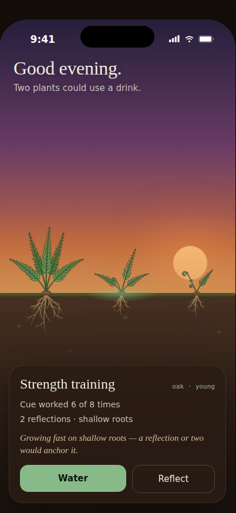

# Garden home — design

*How the home screen looks and behaves once the garden is drawn. Read this before touching
`lib/features/garden/` or wiring any plant art.*

**Governs:** the garden home screen: scene, layout, how the plant art sits in it, and the
watering and reflection moments on it.
**Built on:** [design-spec.md](design-spec.md) §4 and §6 (the metaphor and the visual direction),
[growth-engine.md](growth-engine.md) §3–§5 (the stage, vitality and roots values it draws).
**Inputs it reconciles:**

- the design agent's prototype, kept in
  [design/garden-home-handoff/](design/garden-home-handoff/) (`README.md`, `tokens.json` and an
  HTML prototype; open `Garden Home.dc.html` through a local web server, not `file://`);
- the Rive plant art in `fern/` (see `fern/NOTES.md`): six stage artboards plus `FernRoots`,
  bound to `vitality` and `roots`.

The prototype and the plant art were made separately and disagree in places. **Where they
disagree, this document decides.** Section 9 lists every such disagreement and its
resolution. Anything this document doesn't mention follows the prototype README.

*Reference mock-up (dusk): the prototype scene with the real fern art at the chosen scale. From
left to right: Mature (healthy, deep roots), Young (thirsty, shallow roots, selected) and
Seedling (thirsty). A Seed sits just past the right edge, waiting to be scrolled to.
Every plant is a fern because the fern is the only species with art.*

---

## 1. What changes

The home screen stops being a **list of cards** and becomes **one garden**: a single vertical
cross-section with sky above, a grass line, and soil below with roots visible. Each habit is one
plant standing on the shared ground line. One floating **detail card** shows the selected plant
and its actions.

What stays from the current `GardenPage`:

| Current piece | Where it goes |
|---|---|
| Press-and-hold watering (`WateringControl`, `AppMotion.waterHoldDuration`) | The **Water** button on the detail card. Unchanged gesture. |
| Undo after watering | A text button on the detail card, next to the Water button, for `AppMotion.undoOfferDuration`. |
| Error snackbar via `gardenErrorProvider` | Unchanged. |
| Check-in invitation chip (`checkInOfferProvider`) | In the header, under the status line. Unchanged rule: only shown when there is an offer. |
| "Plant another" floating button | Removed. Replaced by an **empty plot** at the end of the row (§4.5). |
| "Taproot" page title | Removed from home. The time-of-day greeting replaces it. |
| Loading / unreadable / empty states | Kept, drawn on the garden scene instead of a blank page (§4.6). |
| Word-only plant card (`PlantCard`) | Removed from home. Its semantic label moves onto the plant (§8). |

---

## 2. Principles

1. **One world, one scale.** Every plant is drawn at the same world scale on the same ground
   line. Size differences between plants are growth, never layout.
2. **The soil is always visible.** The "tall plant on shallow roots" message (growth-engine §3)
   only works if roots are always in view. No hidden or pull-down soil.
3. **Rive owns the plant; Flutter owns the world.** Flutter must not rotate, scale or recolour a
   plant to express vitality or roots. That is already in the art (§5). Flutter places plants,
   draws everything around them and writes two numbers.
4. **Visit, don't owe.** No counters, no "0 of 3 done", no red. The header says how the garden
   is, not what is due (design-spec §6).
5. **Every animation has a still equivalent.** Everything goes through `GardenTicker`. With motion
   off, every state change still applies, instantly (§8).

---

## 3. Scene layers

Back to front. Coordinates are logical points on a 402 × 874 reference frame. Values not given
here come from the handoff README, "Layers".

| # | Layer | Owner | Notes |
|---|---|---|---|
| 1 | Sky gradient | Flutter | Per time of day (§7). Fixed while the garden scrolls. |
| 2 | Sun / moon | Flutter | Fixed. Position per mode, as in the README. |
| 3 | Horizon haze | Flutter | Fixed. 140pt band ending at the ground line. |
| 4 | Grass band | Flutter | 7pt band, top edge = **ground line `G`**. Scrolls with the plants. |
| 5 | Soil + strata + pebbles | Flutter | Scrolls with the plants. Pebbles are seeded per scene width, not fixed at 7. |
| 6 | Damp patches | Flutter | Under watered plants (§6.1). |
| 7 | **Roots** | **Rive — `FernRoots`** | One per plant (§4.3). Replaces the prototype's drawn lines. |
| 8 | Selection glow | Flutter | Under the selected plant, at `G`. |
| 9 | **Plants** | **Rive — stage artboard** | One per plant (§4.3). |
| 10 | Watering drop + ripple | Flutter | §6.1. |
| 11 | Header | Flutter | Greeting, status line, check-in chip. Fixed. |
| 12 | Toast | Flutter | One-line confirmations. Not used after a check-in (§6.2). |
| 13 | Detail card | Flutter | Fixed, floats over the soil. §4.4. |

The garden scrolls **horizontally**. Layers 1–3, 11 and 13 stay put; layers 4–10 scroll together.
This makes the sky a backdrop and the ground a place you move along.

---

## 4. Layout

### 4.1 The ground line

`G` = 53% of the screen height, measured from the top of the full screen. With the reference
frame that is y = 466. Everything below is placed relative to `G`, so the layout scales with the
viewport.

Keep at least **90pt of soil** visible between `G` and the top of the detail card, so
full-depth roots (§4.2) are never covered. On short screens, move `G` up rather than letting the
card cover roots.

### 4.2 World scale

**One art pixel = 0.15 pt.** This number is `GardenLayout.worldScale`, a design token in
`lib/app/theme/` next to `AppMotion`, never inlined.

| Art | Canvas (art px) | On screen (pt) | Anchored |
|---|---|---|---|
| Stage artboards (`FernSeed` … `FernBloom`) | 1024 × 1024 | 153.6 × 153.6 | canvas **y = 900** sits on `G` |
| `FernRoots` | 1024 × 520 | 153.6 × 78 | canvas **y = 0** sits on `G` |

Both artboards are horizontally centred on the plant's x. At this scale a mature fern is about
115pt tall and full roots reach 78pt down. A seed is about 11pt wide: small but readable. Size
is the growth story, so don't enlarge early stages.

The canvases are larger than the plant, so the artboards overlap neighbouring slots. That's
intended: they are transparent, and a mature fern's outer fronds may reach into the next slot.

### 4.3 Slots and scrolling

- **Slot pitch: 128pt.** The first slot's centre is at 16 + 64 = 80pt from the scene's left edge.
  Plant *n* sits at `80 + 128·n`.
- About three plants are visible on a 402pt-wide screen. The fourth sits just past the right
  edge, so a wide plant there peeks in and shows that the row scrolls.
- **Order:** by habit creation time, oldest on the left. Stable: a stage change never reorders.
- **Paint order:** left to right. The selected plant is **not** raised; it's marked by the
  glow alone.
- Each plant is a `Stack` of two `RiveWidget`s: `FernRoots` below `G` and the stage artboard
  above. Both are driven by **one shared `ViewModelInstance`** per habit
  (`DataBind.byInstance`). Two auto-binds give two unrelated instances, and the roots and the
  lean then disagree silently (`fern/NOTES.md`, "The stacking contract").
- **Hit target:** the whole slot column, 128pt wide, from the top of the plant's drawn bounds to
  the bottom of its roots. Tapping anywhere in it selects the plant. Tapping the soil between
  columns does nothing.
- **On selection**, scroll the plant fully into view if it isn't already.
- **Off-screen plants** stop their ambient loop (pause the controller) and resume when they
  scroll back.

### 4.4 Detail card

As in the handoff README ("Detail card"), with these changes:

- **Water button:** the existing press-and-hold `WateringControl`, with its existing copy
  (`Hold to water`, then `Hold to water again`). It stays enabled after a watering, because the
  app already records more than one completion a day. An `Undo` text button sits alongside while
  the undo offer lasts. The prototype's disabled `Watered today` state is not adopted.
- **Reflect button:** shown only when `checkInOfferProvider` offers *this* habit. It opens the
  **check-in sheet** over the garden with that offer (see [check-in-design.md](check-in-design.md)).
  Otherwise the Water button takes the full width. This keeps reflection-logic's "don't ask every
  time" (see §10, open question 3).
- **Lines:** `Cue worked {hit} of {total} times` and
  `{n} reflections · {rootDepthLabel(R)}`, where `n` is the plain count of answered
  reflections (never the weighted credit sum), using the **existing** `plant_descriptions.dart`
  bands, not the prototype's (§9).
- **Hint:** the prototype's three rules, first match wins. "Shallow" uses the engine's advisory
  threshold for the stage (young 0.30, mature 0.50), read from `constants.dart`.
- Species · stage label, right-aligned in mono: `{plantChoice.label} · {stageLabel}`, lowercase.

### 4.5 The empty plot

After the last plant, one more slot: a slight dip in the soil with a small wooden marker
reading **Plant something**. Tapping it opens habit creation (`AppRoutes.habitCreation`). This
replaces the floating "Plant another" button, and new plants appear where the offer was.

### 4.6 Loading, empty and unreadable states

All three keep their existing copy and logic, drawn on the scene (sky, grass, bare soil):

- **Loading:** the scene with no plants and no card. No spinner on the ground; a small progress
  indicator in the header if loading takes longer than 300 ms.
- **Empty:** the scene, the empty plot in slot 0, and the existing empty headline and body in
  place of the detail card.
- **Unreadable:** the scene with no plots, and the existing unreadable copy and **Try again** in
  place of the detail card.

---

## 5. What the art does, and what Flutter must not do

The Rive art already expresses the engine's state. Flutter's only job is to write two numbers
per plant and choose the artboard.

| Engine value | Written to | What the art does | Flutter must not |
|---|---|---|---|
| Stage | artboard choice `fernArtboardFor(stage)` | Different plant; cross-fade on advance (`AppMotion.stageAdvanceDuration`) | Scale plants per stage |
| Vitality `V` (0–1) | view model `vitality` | Fronds droop outward, leaves fade to dry sage, sway shrinks (never below 40%), eased by a 0.6 s interpolator | Rotate or tint the plant for droop |
| Roots `R` (0–1) | view model `roots` | Root system grows through five poses (0, .15, .30, .50, .75), 1.2 s ease; Young and Mature lean up to 5° while `R` is below their threshold | Draw roots or lean the plant |
| — | — | Ambient sway, built in | Add a second sway |

The seed ignores `vitality` by design: the engine has no vitality before the first completion.

**Species without art** (five of six today) render as the prototype's **placeholder silhouette**:
dashed outline, hatched fill, species and stage in mono. Its roots are the prototype's drawn
lines. It's an honest "not drawn yet" and keeps the garden one world. Size the silhouette to the
fern stage of the same number at world scale.

---

## 6. Moments

### 6.1 Watering

Starts when the hold on **Water** completes (`AppMotion.waterHoldDuration`, never scaled).

| t (ms) | What happens |
|---|---|
| 0 | Completion written locally (never fails, never spins). Engine state updates. **Do not yet write `vitality` to Rive.** |
| 0–650 | Drop falls from 110pt above `G` to the plant's base (prototype curve), flattening on landing. |
| 560 | **Landing:** write `vitality = 1` to the plant's view model. Rive eases the plant upright and green over 0.6 s. Haptic: light impact. Ripple starts (700 ms). |
| 480–1380 | Damp patch fades in under the plant (900 ms). |
| 1500 | Moment over. Card shows `Hold to water again` + `Undo`. |

Only one watering animation runs at a time. A hold on a plant that is already at `V = 1` is
still recorded (the engine counts it), but it plays only the drop and ripple.

**Undo:** write the engine's recomputed `vitality` straight away (Rive eases back down), fade the
damp patch out over 300 ms, no drop.

**Reduced motion (`motionScale == 0`):** no drop, no ripple. Write `vitality` at t = 0 and show
the damp patch at once. Rive's 0.6 s interpolator still eases (see §10, open question 4).

The prototype's springy "perk-up" overshoot is **not** in the art yet. If wanted, it belongs in
the Rive file (`cubicValue` on the droop, per `fern/NOTES.md`), not as a Flutter rotation.

### 6.2 Reflection

Reflection happens in the check-in sheet over this garden, and its roots payoff plays behind the
sheet: see [check-in-design.md](check-in-design.md) §3 and §7. The garden itself only:

- keeps the reflected plant selected;
- shows the new roots wording on the detail card once the sheet closes.

There is **no toast** after a check-in; the sheet's done state already says it. The toast layer
stays for other one-line confirmations.

### 6.3 Stage advance

The existing cross-fade in `PlantArtView`. Apply it to both artboards only when the stage
changes; the roots artboard doesn't change with the stage.

---

## 7. Time of day

- **Mode** from the local hour: night before 06:00, dawn before 09:00, day before 17:00, dusk
  before 20:00, then night. (This matches the prototype's code; its README omits the 06:00 cut.)
  Re-check once a minute, and only while ambient motion is on. Otherwise check on resume.
- **Sky, sun, haze and greeting** per mode, as in the handoff README and `tokens.json`. Cross-fade
  1.2 s on change, instant when still.
- **Plant light:** the art has fixed colours, so a bright green fern at night looks pasted on.
  Apply one `ColorFiltered` over the plant and roots layers per mode: day none; dawn and dusk a
  warm multiply at about 8%; night about 70% brightness with a slight cool shift. The exact
  amounts are an open calibration (§10, open question 5); the principle isn't.

---

## 8. Colour, type, accessibility

**Scene colours** come from `tokens.json` into a new `lib/app/theme/garden_colors.dart`
(`GardenColors`). These are scene-only colours (sky, soil, grass, water, damp, glow), so they
don't count against `AppColors`' three-hue rule. **Chrome** (card, buttons, text) uses the
**dark** `ColorScheme` on this screen whatever the system setting, because the scene is always a
dark-ground scene. `colorScheme.primary` (moss, lifted) is the Water button; the prototype's
accent is close enough not to need a new colour.

**Plant art colours** are the `fern/` palette with two changes made in the generator
(§10, build step 7):

- plant outline stroke widths × 2, so outlines survive the 0.15 scale (2.6 art px would be under
  0.4 pt);
- roots recoloured to the garden's `root` → `rootFade` (#9F8056 → #917552, fading toward the
  tips), with **no dark outline**, which disappears against the soil anyway.

**Type:** the prototype uses Newsreader (display, hints) and Karla (UI). `themedata.dart` bundles
no font yet. Adding these two is part of this work, bundled rather than fetched at runtime.

**Semantics:** each plant slot carries `plantSemanticLabel(...)` from `plant_descriptions.dart`,
including the shallow-rooted clause. The Rive widgets are `ExcludeSemantics`. The empty plot is a
button labelled "Plant something". The scroll view announces position ("Plant 2 of 5").

**Motion:** sway, sky cross-fades, the drop, the ripple and damp fades all go through
`GardenTicker`. Tests run with `GardenTicker.still`.

---

## 9. Where the prototype and the art disagree

| Topic | Prototype | Plant art (`fern/`) | **Decision** |
|---|---|---|---|
| Home structure | One garden scene | (n/a) | **Garden scene** (the app currently shows cards) |
| Plant size | Per-species placeholder boxes (lotus 88×150, fern 56×64 …) | One canvas, one scale for all stages | **World scale 0.15** for everything (§4.2) |
| Slot spacing | Fixed x 64/160/252/336; README: min 84pt, scroll past 4 | (n/a) | **128pt pitch**, scroll (§4.3) |
| Droop | Whole plant rotates −14°·(1−V), always leftward | Fronds fall outward from the centre, leaves fade, sway shrinks | **Art.** Flutter doesn't rotate. |
| Shallow-roots lean | Fixed −3° when `R` < ρ | Gradual, up to 5°, Young and Mature only, declared direction | **Art.** |
| Sway | ±1.2° whole-plant CSS loop | Per-frond, vitality-scaled | **Art.** Flutter adds none. |
| Thirsty colour | Olive placeholder fill | Dry sage fade in the art | **Art** (the placeholder keeps olive) |
| Roots | Drawn lines: taproot 12 + R·150pt plus laterals | `FernRoots`: branching tree, five poses, 78pt deep at scale | **Rive roots**, recoloured (§8) |
| Root growth timing | 800 ms | 1.2 s interpolator | **1.2 s** (the art) |
| Root-depth words | shallow < .30 < taking hold < .60 ≤ deep | `plant_descriptions.dart`: .30 / .50 / .75 | **Existing descriptions** |
| Watering gesture | Tap Water, or tap the selected plant | App: press-and-hold + undo | **Hold + undo.** Tapping a plant only selects it. |
| After watering | Button disabled, `Watered today` | App: `Hold to water again` | **Existing copy, stays enabled** |
| Perk-up | 900 ms overshoot spring after 450 ms | 0.6 s ease, no overshoot | **Art as is.** Overshoot is a possible art follow-up (§6.1). |
| Vitality write timing | Immediate, CSS delays the visual | Interpolator from the moment of the write | **Write at drop landing** (§6.1) |
| Reflect | Always visible; increments N, toasts | (n/a) | **Only when offered**; opens the check-in (§4.4) |
| Plant labels | Mono species/stage on the placeholder | (n/a) | **Placeholders only.** Drawn plants have none. |
| Selection | Ground glow + 2pt ring on the box | (n/a) | **Glow only** |
| "sprout" as a species | Journal is `type: sprout` | Sprout is a stage | **Stage only.** Species come from `plant_choices.dart`. |
| Seed stage | Named in the stage words, not shown | `FernSeed` exists | **Shown.** Seed in a mound, ignores vitality. |
| Title / add button | Neither | (app: "Taproot" title, FAB) | **Greeting + empty plot** (§1, §4.5) |

---

## 10. Build order and open questions

### Build order

Each step keeps the three gates green and ends with a screenshot on a device.

1. **Scene shell.** `GardenColors`, the fonts, `GardenLayout` tokens, sky, grass, soil, header and
   detail card, with placeholder plants in fixed slots. No Rive.
2. **Layout.** Slot pitch, horizontal scroll with fixed sky and header, hit columns, selection
   glow, scroll-into-view, the empty plot, and the loading, empty and unreadable states on the
   scene.
3. **Stage art in slots.** Move `PlantArtView` into the slot at world scale, anchored at canvas
   y = 900. Placeholder silhouettes for species without art. Remove `PlantCard` from home.
4. **Roots.** Add `FernRoots` under each fern slot, and switch both controllers to **one shared
   `ViewModelInstance`** (`DataBind.byInstance`). Add `fernRootsArtboard` and
   `fernRootsProperty` to `plant_art.dart` and to `fern_asset_test.dart`. Write `roots` from the
   engine. Test that one write is visible through both artboards.
5. **Moments.** Watering choreography (§6.1) with the landing-time vitality write, damp patch,
   ripple and haptic; undo (§6.1).
6. **Time of day.** Modes, cross-fades, plant light filter (§7).
7. **Art pass in `fern/`** (can run in parallel with steps 1–3). Outline widths × 2, root
   recolour without outline, rebuild, copy `fern.riv` into `assets/rive/`.

Update `docs/status.md` and `docs/progress-log.md` as each step lands, and add this document to
the spec table in `CLAUDE.md`.

### Open questions

These are calibration questions, not settled. Implement the default and name the question.

1. **World scale 0.15 and pitch 128.** Chosen from a mock-up at 402pt width. Check them on the
   smallest supported phone and on a tablet (does the tablet show more plants or bigger ones?).
2. **The seed at about 11pt.** Readable in the mock-up, but it may need a marker stake when a
   user's first habit is still a seed.
3. **Reflect only when offered.** This follows reflection-logic, but it means a user can't choose
   to reflect. The check-in design keeps this rule; revisit with usage data.
4. **Reduced motion and the Rive interpolators.** Flutter can't skip the 0.6 s and 1.2 s eases in
   the file. If instant is required, the file needs a smoothing switch.
5. **Plant light filter amounts** per time-of-day mode.
6. **Species without art.** Placeholder silhouettes mixed with drawn ferns is honest but uneven.
   Whether the remaining five species can be generated in the fern's style is the open art
   question in `docs/status.md`.
